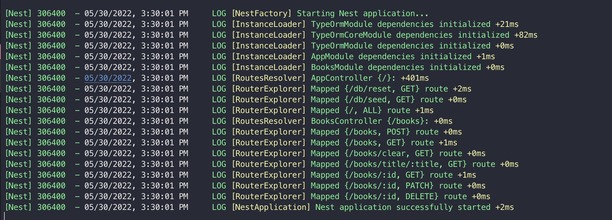
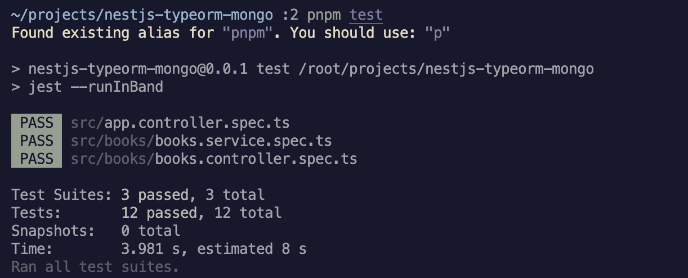
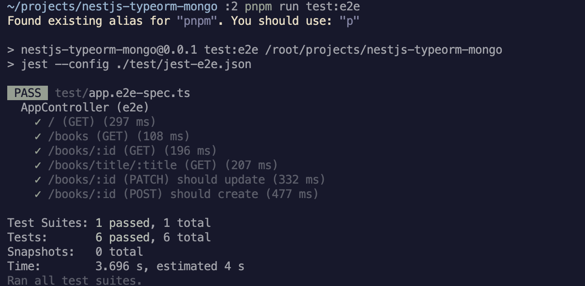
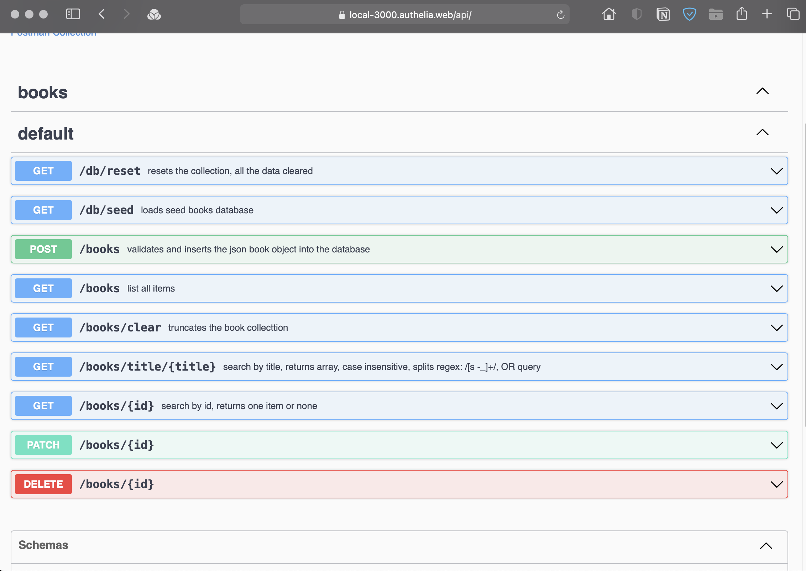
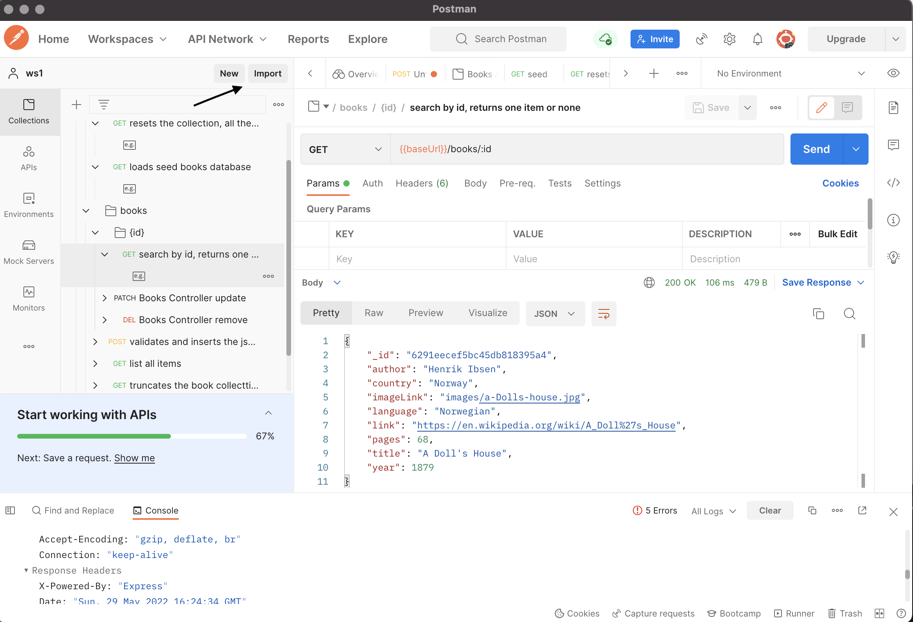

<!-- https://github.com/nestjsx/crud -->

<div align="center">
  <h1>:point_right:<a href="https://github.com/maccallios/nestjs-typeorm-mongodb-swagger">NestJs CRUD seed project
  </a></h1>
</div>

<div align="center">
  <strong>RESTful demo API built with NestJs</strong>
</div>

<br />




## Features

- :electric_plug: Super easy to install and start :point_right:

- :octopus: MongoDB nosql database used, but could be sql-type via TypeORM integration

- :mag_right: Data Mapper/Repository pattern(not Active Record), shows simple text search functionality via MongoDB full-text search index

- :telescope: extensive services/controller and app testing via Jest and supertest

- :space_invader: centralized named exports, custom decorators usage to simplify logic

- :clapper: demonstrates OpenApi 3.0 usage with swagger UI

- :wrench: added the link to export OpenApi description into Postman directly plain json file

- :gift: demonstrates helpers decorator usage for routes, validation

- :pencil2: Swagger documentation and examples

## Packages

- [**@nestjs**](https://nestjs.com) - core NestJs framework)
- [**mongodb**](https://www.npmjs.com/package/mongodb) - MongoDB NodeJS Driver ([docs](https://www.mongodb.com/docs/drivers/node/current/))
- [**typeorm**](https://www.npmjs.com/package/typeorm) - ORM for TypeScript and JavaScript (ES7, ES6, ES5). Supports MySQL, PostgreSQL, MariaDB, SQLite, MS SQL Server, Oracle, SAP Hana, WebSQL databases. ([docs](https://github.com/nestjsx/crud/wiki/ServiceTypeorm))
- [**@nestjs/swagger**](https://www.npmjs.com/@nestjs/swagger) - OpenAPI (Swagger) module for NestJS. ([docs](https://swagger.io/specification))
- [**Jest**](https://www.npmjs.com/jest) - JavaScript Testing Framework with a focus on simplicity. ([docs](https://jestjs.io))
- [**supertest**](https://www.npmjs.com/supertest) - HTTP assertions made easy via superagent. ([docs](https://github.com/visionmedia/supertest#readme))

## Getting Started

```
git clone https://github.com/maccallios/nestjs-typeorm-mongodb-swagger
cd nestjs-typeorm-mongodb-swagger
pnpm install
pnpm run start:dev
```

This command will run the development environment, source tree will be watched for changes and app will restart on changes.

## Running the tests

```
p jest
```



runs all the Jest tests defined in

* [app.controller.spec.ts](src/app.controller.spec.ts)
* [books/books.module.spec.ts](src/books/books.module.spec.ts)
* [books/books.controller.spec.ts](src/books/books.controller.spec.ts)
* [books/books.service.spec.ts](src/books/books.service.spec.ts)


*It is possible to run the test by partial name match,
for example "p jest --runInBand -t 'AppController'"
will run all the tests in [app.controller.spec.ts](src/app.controller.spec.ts).

Since we use a single mongo instance jest test must be performad in sequential (default is paralell), by adding --runInBand argument.

### Jest TypeORM repository mocking
[books/books.module.spec.ts](src/books/books.module.spec.ts)
shows Jest mocking the original typeORM repository(which is injecteds by NextJS into BookService instance), so BookService uses the mocked repository for every ORM operation. It is possible to test the BookService all way to the ORM level, including the method arguments, etc.


## End to end tests

```
pnpm run test:e2e
```



while the controller and services tests usingg shortcomings,
this is end-to-end test.

This tests the CRUD and search functionality.
see [test/app.e2e-spec.ts](test/app.e2e-spec.ts) file.

the tests can be run by pattern with -t switch

### Validation with [class-validator](https://github.com/typestack/class-validator) package

class-validator package provides nice and programmer-friendly API
for decorator and non-decorator based validation. Internally uses [validator.js](https://github.com/validatorjs/validator.js) to perform validation.

```typescript
export class CreateBookDto {
  @IsString()
  title: string;
  
  ...
  ...
}
```

We create BooksValidationPipe which implements [PipeTransform](https://docs.nestjs.com/pipes) NextJS interface.

```typescript
@Injectable()
export class BooksValidationPipe implements PipeTransform<any> {
  async transform(value: any, { metatype }: ArgumentMetadata) {

    const obj = plainToClass(metatype, value)
    const errors = await validate(obj)

    if (errors.length > 0) {
      throw new HttpException({
        status: HttpStatus.FORBIDDEN,
        error: 'validation failed',FORBIDDEN
        errors: JSON.stringify(errors),
      }, HttpStatus.FORBIDDEN)
    }

    return value
  }
}
```

If there is an error we throw HttpException which will be sent in Response,
otherwise just return the original value.


```typescript
@Controller('books')
export class BooksController {
  ...
  create(@Body(BooksValidationPipe) createBookDto: CreateBookDto) {
    return this.booksService.create(createBookDto);
  }
```

This is included in end-to-end test [test/app.e2e-spec.ts](test/app.e2e-spec.ts) file:

```typescript
await request(app.getHttpServer())
  .post(`/books`)
  .send({ ...book, author: 100 })
  .expect(HttpStatus.FORBIDDEN)
  .expect('Content-Type', /json/)
```


### Text Search

This functionality uses Mongo Full Text search,
text index tokenizes and stems the terms in the indexed fields for the index entries.

The index query uses tokens, so for example for the title `The House` we can search `house`. It also uses OR query for words.

## OpenApi and Swagger UI

Swagger Ui is exposed at /api endpoint



I also provided ready to click examples for most of operation.
> for insert operation make sure to clear the database if use default id_, otherwise you can `ducplicate id_ error`

`/db/reset` clears the database and creates the index

`/db/seed`  clears and seeds the database

## Postman

Because controllers annotated NestJS generates OpenApi 3.0 json schema for test, it can be downloaded and plain json file from 
Postman Collection link at /api Swagger Page.

link is `/api-json`

This needs to be saved and uploaded to Postman via import functionality.

It is possible to vew the saved test in [Swagger Editor](https://editor.swagger.io) online, just copy-paste the json.




The desktop version gives an error, however web version imports the file and this can be opened on desktop client.

It runs the same test as Swagger UI
